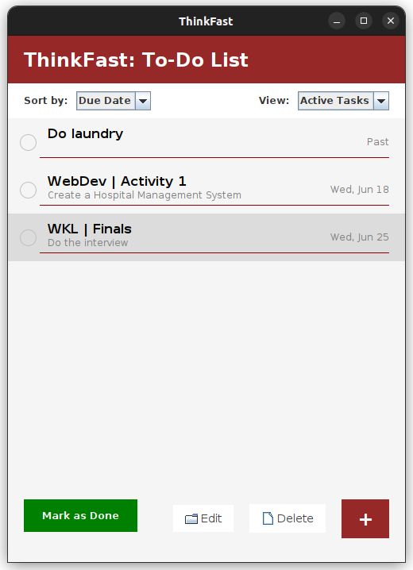
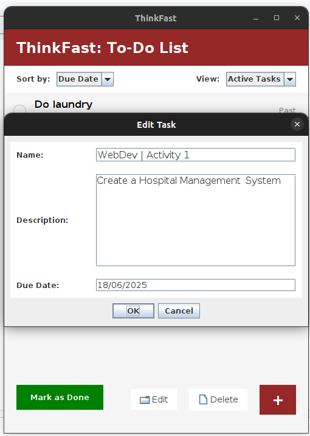
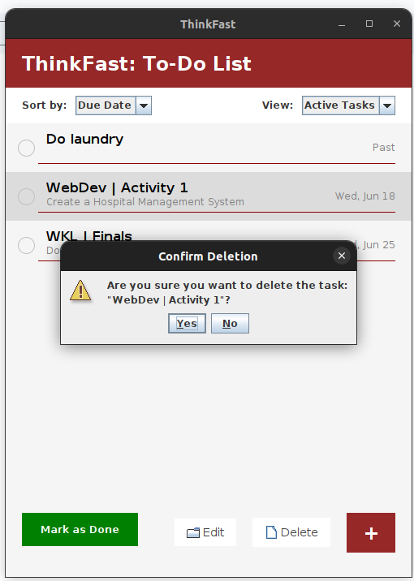
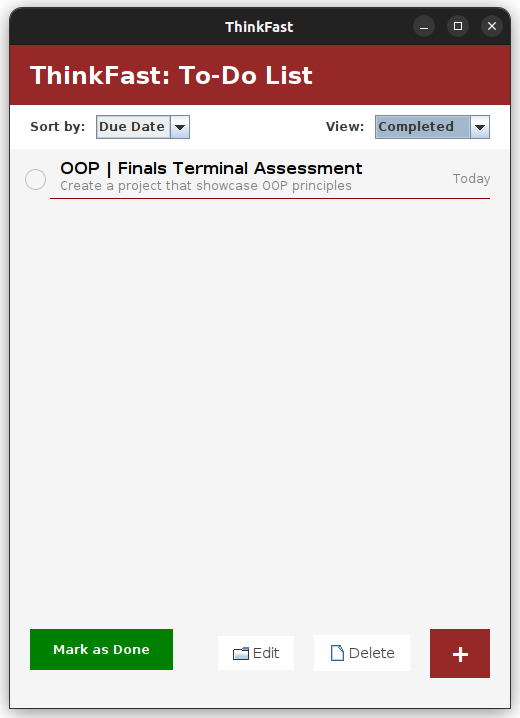

## ThinkFast: A Clean and Simple To-Do List Application

**ThinkFast** is a lightweight Java desktop application for tracking tasks and staying organized. It features a clean interface, intuitive controls, and emphasizes solid Object-Oriented Programming (OOP) design.

This project demonstrates essential Java concepts, including:

- Classes and Objects
- Encapsulation, Inheritance, Polymorphism, Abstraction
- Interfaces and Abstract Classes
- Arrays and ArrayLists
- String Handling
- Exception Handling
- File Input/Output (I/O)
- Recursion (optional)
- Java Collection Framework

### Features
- Add, edit, and delete tasks
- Sort tasks by priority
- Simple, focused, and clutter-free interface
- Tasks are saved locally using text file I/O

## Screenshot







### How to Run

Follow these steps to run the application locally:

#### 1. Clone the repository

```bash
git clone https://github.com/melio0504/thinkfast
cd ThinkFast
```

#### 2. Navigate to the src folder

```bash
cd src
```

#### 3. Compile the Java files

```bash
javac ThinkFast.java SplashScreen.java 
```

#### 4. Run the application

```bash
java ThinkFast
```

---

Note: This is for my finals in Object Oriented Programming subject 
